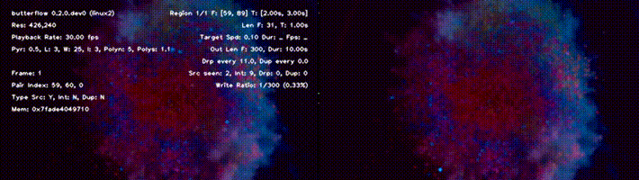

## About
BF is a video manipulation tool that can:

1. Make **motion interpolated videos** (increase a video's frame rate by rendering intermediate frames based on motion using a combination of pixel-warping and blending).
2. Make **smooth motion videos** (do simple blending between frames).
3. Leverage interpolated frames to make **fluid slow motion videos**.

BF works by rendering intermediate frames between existing frames using a process called [motion interpolation](http://en.wikipedia.org/wiki/Motion_interpolation). Given two existing frames, `A` and `B`, this program can generate frames `C.1`, `C.2`...`C.n` positioned between the two. In contrast to other tools that can only *blend or dupe* frames, this program *warps pixels based on motion* to generate new ones.

The addition of interpolated frames gives the perception of more fluid animation commonly found in high frame rate videos, an effect most people know as the "soap opera effect".

Besides creating motion interpolated videos BF can leverage interpolated frames to make fluid slow motion videos:

In these examples BF slowed a `1sec` video down by `10x`. An additional `270` frames were interpolated from `30` original source frames giving the video a smooth feel during playback. The same video was slowed down using FFmpeg without any filters, but because it dupes frames and can't interpolate new ones, the video has a noticeable stutter (shown on the right-hand side).

## Installing
**Important:** BF only works on 64-bit systems.

* ~**macOS:** With [Homebrew](http://brew.sh/), `brew install brewsci/science/butterflow`.~
* **Windows 10 (Portable):** Download:
  * **Preview:** [butterflow-0.2.4.dev0.7z](https://github.com/dthpham/butterflow/releases/tag/v0.2.3)
    * Sha256: 683a4c759fdce5fe4eab9a8f07700e5ee97468343e9692dbf1e0171cedccf235
  * **Stable:** [butterflow-0.2.3.7z](https://github.com/dthpham/butterflow/releases/tag/v0.2.3)
    * Sha256: 1e138b7d88154bed7150a0a155843832cba8d38be07b80bedee9f625c5fa0cc0
* **Arch Linux:** A package is available in the AUR under [`butterflow`](https://aur.archlinux.org/packages/butterflow/).
* **From Source:**
  * **macOS and Linux:** Refer to the [Install From Source Guide](https://github.com/dthpham/butterflow/blob/master/docs/Install-From-Source-Guide.md) for instructions.
  * **Windows:** See [Install on Windows Guide](https://github.com/dthpham/butterflow/blob/master/docs/Install-On-Windows-Guide.md).

## Setup (for Windows and Linux users)
**Note:** No setup is necessary on macOS. Read [this](https://github.com/dthpham/butterflow/blob/master/docs/Setting-Up-OpenCL.md#macos-mavericks-and-newer) if you run into a problem with OpenCL.

BF requires no setup to use but it's too slow out of the box to do any serious work. To take advantage of hardware accelerated methods that will make rendering significantly faster you must set up a functional OpenCL environment on your machine.

**See:** [Setting up OpenCL](https://github.com/dthpham/butterflow/blob/master/docs/Setting-Up-OpenCL.md) for details on how to do this.

## Usage
Run `butterflow -h` for a full list of options. See: [Example Usage](https://github.com/dthpham/butterflow/blob/master/docs/Example-Usage.md) for typical commands.

## More documentation
Check the [docs folder](https://github.com/dthpham/butterflow/tree/master/docs).
