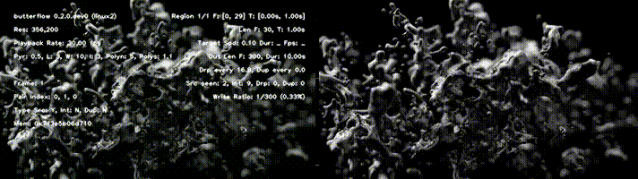

## About
BF is a video manipulation tool that can:

1. Make **motion interpolated videos** (increase a video's frame rate by rendering intermediate frames based on motion using a combination of pixel-warping and blending).
2. Make **smooth motion videos** (do simple blending between frames).
3. Leverage interpolated frames to make **fluid slow motion videos**.

## Demonstration
BF works by rendering intermediate frames between existing frames using a process called [motion interpolation](https://en.wikipedia.org/wiki/Motion_interpolation). Given two existing frames, `A` and `B`, this program can generate frames `C.1`, `C.2`...`C.n` positioned between the two. In contrast to other tools that can only *blend or dupe* frames, this program *warps pixels based on motion* to generate new ones.

The addition of interpolated frames gives the perception of more fluid animation commonly found in high frame rate videos, an effect most people know as the "soap opera effect".

Besides creating motion interpolated videos BF can leverage interpolated frames to make fluid slow motion videos:

In these examples BF slowed a `1sec` video down by `10x`. An additional `270` frames were interpolated from `30` original source frames giving the video a smooth feel during playback. The same video was slowed down using FFmpeg alone, but because it dupes frames and can't interpolate new ones the video has a noticeable stutter (shown on the right-hand side).

## Install
**Requirements:** A 64-bit system with a compatible graphics device.

* **Windows 10 (Portable):** Download the [latest releases](https://github.com/dthpham/butterflow/releases/latest).
  * **Preview:** butterflow-0.2.4.alpha1.zip
    * Sha256: 7210a2714af7c36c48e4b0992caa3f6548697b8da6ef7b7f75f8a6c725bf6af0
  * **Stable:** butterflow-0.2.3.zip
    * Sha256: 5e6402ce435a87064f7aa347f4afa0450844dfb3f2d2e8889ebe6f40e724653b
* **From Source:** See the [Install From Source Guide](docs/Install-From-Source-Guide.md) for instructions.

## Setup
BF requires no setup to use but it's too slow out of the box to do any serious work. To take advantage of hardware accelerated methods that will make rendering significantly faster you must set up a functional OpenCL environment on your machine.

To do this on Windows you will only need to have the latest version of your graphics driver installed. No setup is necessary on macOS as Apple provides OpenCL support by default on all newer Macs. If you're on Linux, please seek other sources on how to satisfy the OpenCL requirement.

You can check if your device is detected with `butterflow -d`. BF will force you to use CPU rendering if there are no compatible devices available.

## Usage
Run `butterflow -h` for a full list of options. See: [Example Usage](docs/Example-Usage.md) for typical commands.

## License
[MIT License](LICENSE)
